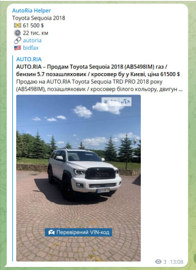
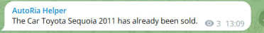
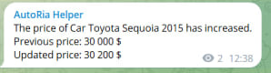

# AutoRia Scraper for Toyota Sequoia
This project is a scraper that fetches data about Toyota Sequoia cars from the AutoRia website. The scraped data is then stored in a SQLite database and sent to a Telegram channel for notification purposes. The scraper runs every 10 minutes to check for new car listings and updates.

## Requirements
- Python 3.x
- requests library (install with pip install requests)
- beautifulsoup4 library (install with pip install beautifulsoup4)
- sqlite3 library (built-in with Python)
- telebot library (install with pip install telebot)

## Usage
### Clone this repository:

```git clone https://github.com/your-username/autoria-scraper.git```

### Install the required libraries:

```pip install -r requirements.txt```

### Set up the Telegram bot:

Create a new Telegram bot by following the BotFather instructions.
Copy the bot token.

### Configure the scraper:

Make .env file and update the following variables:

BOT_TOKEN: Paste your Telegram bot token.

CHANNEL_ID: Enter the ID of the Telegram channel where you want to send the notifications.
### Run the scraper:

```python parser.py```

The scraper will start running and fetch data from the AutoRia website. It will check for new car listings every 10 minutes and store them in the SQLite database.

## Access the data:

The scraped data is stored in the cars.db SQLite database.
You can access the data using your preferred SQLite client or by running SQL queries directly.
## Telegram notifications:

The scraper will send notifications to the specified Telegram channel whenever a new car is found or if there is a price change or the car is sold.
You can check the Telegram channel for the notifications.


